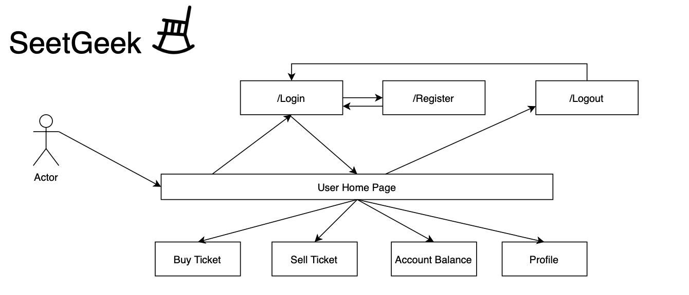

# SeatGeek Architecture

Following from “Organization” of DetailedTestPlan.md …

## Use case diagram

## Login (R1)

**frontend.py**

*login_get*
Is triggered by a GET request. Renders `login.html` page with a ‘Please Login’ message if user is not logged in. 

*login_post*
Is triggered by a POST request. Takes in input text from email and password fields. Validates user email and user password by comparing inputs with user information stored in database. If input format is incorrect, or if information does not match user in stored database, or if there is no user; the `login.html` page is rendered.

## Models

**User** is a model containing fields
id : primary key as a Integer
email : unique email as a string
password : User’s password as a String
name : User’s username
balance : User’s cash balance as a Numeric type

## Register (R2)

**backend.py**

*register_user* 
Takes an email, name, password, and password2, as their respective types based on the model, and registers a new user to the database

**frontend.py**

*register_get*
Is a method that is triggered upon a GET request to /register which checks whether or not the user is logged in, and if not, will render the register page from template “register.html”

*register_post*
Is a method that is triggered upon a POST request to /register which retrieves the necessary fields from the HTML form contained in the request, performs validations on these inputs, if the validations fail then template “register.html” is rendered with an error message, if not, “register_user” from backend.py is called and the user is redirected to GET /login .

## Profile (R3)

**frontend.py**

*profile*
Takes the current user from the `authenticate` function and returns the profile page with the user’s name, balance, and tickets.

## Logout (R7)

**frontend.py**

*logout*
Checks the current session for a logged in user and logs them out. Returns a redirect to the profile page, which when logged out, redirects to the login page.

## 404 Errors (R8)

**frontend.py**

*page_not_found*
Returns the 404 page.

